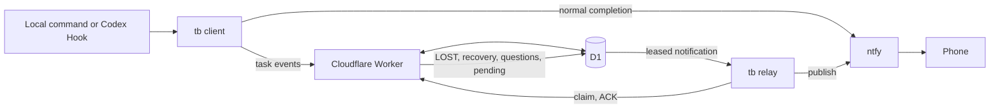

# Architecture

TaskBridge has one shared Worker/D1 service and any number of `tb` clients. Each client has its own scoped token. The Worker stores state and queue entries; it does not publish to ntfy.

## Delivery paths

| Event | First durable record | Publisher |
| --- | --- | --- |
| `tb run` completion or Codex `Stop` | D1 task/event state | Source `tb` directly; D1 fallback queue if direct publication fails |
| Codex `Interrupt` | Local `codex-interrupts/` spool | Relay on that computer submits to D1, then an online relay publishes |
| Watchdog LOST/recovery | D1 | Any online relay |
| MCP question | D1 question and notification | MCP host attempts immediate relay; another relay can take over |

For Codex turns, a local `UserPromptSubmit` Hook timestamps the start. The `Stop` Hook renders a configurable notification with that duration and can optionally append `last_assistant_message`. This final text is never sent unless the client opts in. If the start Hook did not run, duration is `unknown`.

Relays use a two-minute lease and claim token. ACK succeeds only for the current claim. A publish that succeeds while ACK fails may be published again after lease expiry, so external delivery is **at least once**. Notification IDs and task events are idempotent in D1.

## Task state and Watchdog

`tb run` sends a start event, forwards the child process's input/output, records heartbeats, and sends a finish event with the child's exit code. A network failure does not change the child exit code; the client writes failed Worker requests to a local retry queue. `tb retry`, `tb doctor`, or a later run can resend them.

The Worker Cron checks for stale heartbeats every two minutes. It marks stale tasks LOST and queues a notification. A later heartbeat can recover a LOST task and queue a recovery notification. `LOST_TIMEOUT_SECONDS` controls the threshold (420 seconds in the example config).

## Questions

`ask_user` creates a D1 question, publishes an ntfy prompt, then polls for the answer. `begin_question` creates the same record and returns immediately; `question_status` and `answer_question` support a desktop-and-phone race. The first accepted answer wins by a conditional D1 update. Phone action URLs contain a random answer token, and questions expire.

Native Codex questions remain Codex-owned. A supported `PreToolUse` event can mirror a reminder, but the Hook cannot resolve or dismiss the native prompt. Registering MCP only makes its tools available; Codex must call them to create a phone-answerable question. Permission approvals stay with Codex.

## Authentication and secrets

- `TB_ADMIN_TOKEN` is a Worker secret. It can create client identities and should stay only with the administrator.
- Client tokens are stored as SHA-256 hashes in D1. Each computer should have a separate token and only the required scopes.
- `tb` stores its token and ntfy topic in a user config file with restricted permissions. Worker configuration and `.dev.vars` are local files excluded from Git.
- The ntfy topic and any protected-topic token belong on publishing clients, not in Worker source. A random public topic name should be treated as a secret capability.

## API overview

The Worker exposes task start/heartbeat/finish/status, Codex event ingestion, question creation/status/answers, client creation, and notification enqueue/claim/ACK/fail endpoints. Authenticated requests use `Authorization: Bearer <client-token>`. The `tb` CLI and MCP server are the supported clients; see `src/index.ts` for the exact request schemas and route validation.
